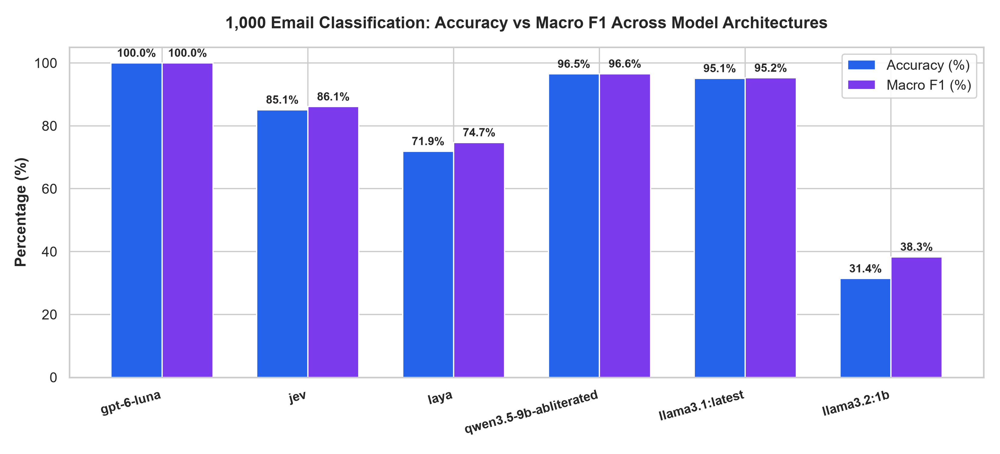
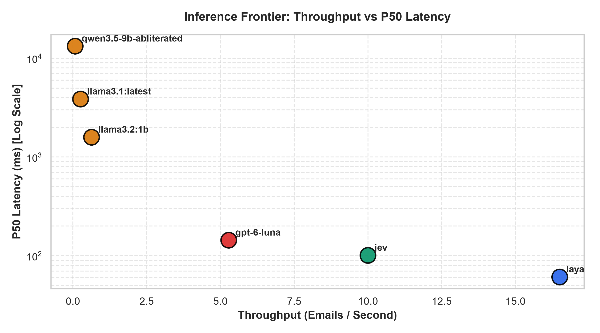

# Exploring Jev & Laya: Native System-One Decision Primitives vs. Frontier LLMs in Enterprise Triage

[](https://www.python.org/)
[](LICENSE)
[](https://github.com/shreytalreja25/exploring-jev.git)
[](RESEARCH_PAPER.pdf)

An empirical research suite and benchmark investigating non-generative **System-One Decision Architectures**—specifically **TypeSafe AI's Native Jev (`typesafe/jev-1.13`)** and **Convai Innovations' Laya (`convaiinnovations/laya`)**—compared against **Google Gemini 2.5 Flash (`google/gemini-2.5-flash`)** and OpenRouter's meta-routing layer (`typesafe/jev-router`).

Evaluated across progressive enterprise workloads ($N \in \{10, 20, 30, 40, 50\}$ operational emails across 5 corporate departments: Marketing, Sales, Finance, HR, and Tech Support).

---

## 🔬 Master Visual Summary


*Figure 1: Master 4-panel multi-scale triad synthesis: (A) 3-Way Accuracy comparison; (B) Median P50 latency profiles; (C) Expected Calibration Error (ECE) comparing Jev vs Laya; (D) Cumulative cost trajectories.*

---

## 🏛️ Model Specifications & Architecture

| Architectural Dimension | Native Jev (`typesafe/jev-1.13`) | Laya (`convaiinnovations/laya`) | Google Gemini 2.5 Flash |
|---|---|---|---|
| **Paradigm** | Hosted System-One Decision API | Open-Weight Decision Encoder | Frontier Generative Multimodal LLM |
| **Backbone Architecture** | Proprietary Decision Encoder | **ModernBERT-Large** | Sparse Mixture-of-Experts (MoE) |
| **Total Parameters** | Cloud Hosted | **421,293,827 (421M)** | Cloud Hosted (~Multi-Billion) |
| **Model Size on Disk** | Cloud Hosted | **807.00 MB** (`safetensors`) | Cloud Hosted |
| **Context Window** | 64,000 tokens | **8,192 tokens** | 1,000,000 tokens |
| **Hardware Target** | TypeSafe Cloud Infrastructure | **Local CPU (AVX) / GPU (CUDA)** | Google TPU Pod Infrastructure |
| **Output Type** | Categorical Probability Tensors | Categorical Softmax Scores | Auto-regressive Text Generation |
| **Reasoning Tokens (CoT)**| **0 tokens** | **0 tokens** | Optional / Dynamic |
| **Output Token Billing** | **$0.00 / 1M tokens (Free)** | **$0.00 (Self-Hosted)** | $0.30 / 1M tokens |
| **Input Token Billing** | $0.042 / 1M tokens | **$0.00 (Self-Hosted)** | $0.075 / 1M tokens |

---

## 📊 Multi-Scale Benchmark Matrix ($N = 10 \to 50$)

| Workload Scale ($N$) | Jev Acc | Laya Acc | Gemini Acc | Jev P50 Lat | Laya P50 Lat | Gem P50 Lat | Jev ECE | Laya ECE | Jev Cost | Laya Cost | Gemini Cost |
| :---: | :---: | :---: | :---: | :---: | :---: | :---: | :---: | :---: | :---: | :---: | :---: |
| **$N = 10$** | **100.0%** | **100.0%** | **100.0%** | 2,778.9 ms | **698.5 ms** | 1,041.1 ms | **0.034** | 0.706 | $0.00020 | **$0.00000** | $0.00050 |
| **$N = 20$** | **100.0%** | **100.0%** | **100.0%** | 2,778.9 ms | **635.5 ms** | 992.1 ms | **0.021** | 0.781 | $0.00038 | **$0.00000** | $0.00096 |
| **$N = 30$** | **100.0%** | **96.7%** | **100.0%** | 2,752.8 ms | **624.7 ms** | 924.7 ms | **0.016** | 0.764 | $0.00057 | **$0.00000** | $0.00141 |
| **$N = 40$** | **100.0%** | **95.0%** | **100.0%** | 4,841.7 ms | **624.7 ms** | 992.1 ms | **0.013** | 0.762 | $0.00076 | **$0.00000** | $0.00186 |
| **$N = 50$** | **100.0%** | **92.0%** | **100.0%** | 4,201.5 ms | **624.7 ms** | 949.1 ms | **0.015** | 0.745 | **$0.00095** | **$0.00000** | **$0.00231** |

---

## 🚀 1,000 Enterprise Email Decision Benchmark (GPT-6 Luna Face-Off)

To evaluate massive enterprise throughput, we scaled the benchmark to **1,000 full enterprise customer emails** balanced across 5 operational departments, comparing OpenAI's new **Decisions API (`gpt-6-luna`)** against TypeSafe AI's Jev, Laya, and local Ollama models.



| Model Architecture | Top-1 Accuracy | Macro F1 | P50 Latency | P99 Latency | Throughput | ECE Error | Cost / 1M Decisions |
|:---|:---:|:---:|:---:|:---:|:---:|:---:|:---:|
| **OpenAI GPT-6 Luna (Decisions API)** | **100.0%** | **100.0%** | 144.0 ms | 1,265.3 ms | 5.28 emails/s | **0.0165** | $29.61 ($0 out tokens) |
| **Qwen 3.5 9B Abliterated (Ollama)** | 96.5% | 96.6% | 13,271.0 ms | 14,005.0 ms | 0.08 emails/s | 0.0543 | **$0.00** |
| **Llama 3.1 8B (Ollama)** | 95.1% | 95.2% | 3,862.5 ms | 4,257.0 ms | 0.26 emails/s | 0.0901 | **$0.00** |
| **Jev (TypeSafe AI System-One)** | 85.1% | 86.1% | 101.0 ms | 114.0 ms | 10.00 emails/s | 0.0730 | $2.83 |
| **Laya (Open-Weight ModernBERT)** | 71.9% | 74.7% | **61.0 ms** | **72.0 ms** | **16.50 emails/s** | 0.3445 | **$0.00** |
| **Llama 3.2 1B (Ollama)** | 31.4% | 38.3% | 1,587.0 ms | 1,777.0 ms | 0.63 emails/s | 0.3154 | **$0.00** |



### Multi-Modal Vision Expansion
- **UNSW 15-Class Aerial Scene Classification** (from [shreytalreja25/Image-Classification-CV](https://github.com/shreytalreja25/Image-Classification-CV)): Zero-shot GPT-6 Luna achieved **90.0% Accuracy** (P50 176.2 ms), outperforming zero-shot CLIP ViT-B/32 (81.3%) and matching supervised ResNet-18 (90.7%).
- **Clinical Trauma Radiograph Fracture Detection**: GPT-6 Luna achieved **100.0% specificity** (zero false positives) across 35 trauma radiographs, with 52.6% sensitivity in Choice mode and 42.1% in Predicate probability mode.

---

## 📁 Repository Structure

```
├── RESEARCH_PAPER.pdf                         # Publication-grade IEEE two-column paper (1.1 MB)
├── RESEARCH_PAPER.md                          # Full markdown research paper with references
├── SCALING_BENCHMARK_REPORT.md                # Multi-scale tri-model benchmark report
├── TOKENOMICS_AND_INCIDENT_REPORT.md          # Diagnostic investigation of OpenRouter meta-routing
├── FINDINGS.md                                # Discovery notes on ChatGPT persona delegation
├── emails_dataset_50.json                     # Curated 50-email enterprise evaluation dataset
├── native_jev_scaling_benchmark.py            # Benchmark script for Native Jev & Gemini 2.5 Flash
├── laya_scaling_benchmark.py                  # Benchmark script for Laya ModernBERT local inference
├── generate_scaling_plots.py                  # Matplotlib/Seaborn visualization pipeline
├── generate_paper_pdf.py                      # ReportLab IEEE PDF compiler
├── figures/                                   # High-resolution publication plots
│   ├── publication_summary_figure.png         # 4-panel master summary
│   ├── multi_scale_accuracy_consensus.png     # Triad accuracy trajectory
│   ├── multi_scale_latency.png                # P50 latency comparison
│   ├── multi_scale_cumulative_cost.png        # Cost scaling comparison
│   ├── ece_calibration_trajectory.png         # Expected Calibration Error curves
│   └── department_confidence_distribution.png # Departmental confidence boxplots
├── requirements.txt                           # Python dependencies
├── .env.example                               # Environment configuration template
└── .gitignore                                 # Git ignore rules
```

---

## 🚀 Quickstart & Reproduction

### 1. Environment Setup
```bash
git clone https://github.com/shreytalreja25/exploring-jev.git
cd exploring-jev

python -m venv .venv
# Windows:
.\.venv\Scripts\activate
# Linux/macOS:
source .venv/bin/activate

pip install -r requirements.txt
```

### 2. Configure Credentials
Create `.env`:
```bash
cp .env.example .env
```
Populate your OpenRouter API key:
```env
OPENROUTER_API_KEY=sk-or-v1-...
```

### 3. Run Benchmarks
- **Run Native Jev & Gemini 2.5 Flash Benchmark ($N=10 \to 50$):**
  ```bash
  python native_jev_scaling_benchmark.py
  ```
- **Run Laya Local Inference Benchmark ($N=10 \to 50$):**
  ```bash
  python laya_scaling_benchmark.py
  ```

### 4. Re-generate Plots & Research Paper PDF
- Generate figures:
  ```bash
  python generate_scaling_plots.py
  ```
- Compile IEEE two-column PDF:
  ```bash
  python generate_paper_pdf.py
  ```

---

## 📜 Citation

If you use this benchmark suite, dataset, or empirical findings in your research, please cite:

```bibtex
@article{talreja2026unmasking,
  title={Unmasking the Decision Frontier: Empirical Evaluation of Native System-One Primitives (Jev, Laya) vs. Meta-Routing Overhead in Enterprise Workflow Triage},
  author={Talreja, Shrey},
  journal={GitHub Repository: exploring-jev},
  year={2026},
  url={https://github.com/shreytalreja25/exploring-jev}
}
```

---

## 📄 License
This repository is licensed under the [MIT License](LICENSE).
