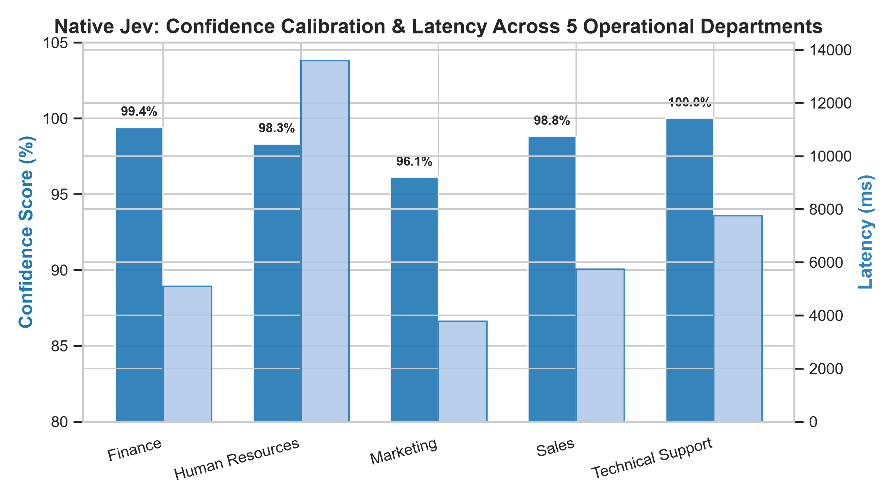

# Unmasking the Decision Frontier: Empirical Evaluation of Native System-One Primitives vs. Meta-Routing Overhead in Enterprise Workflow Triage

**Author:** Shrey Talreja  
**Affiliation:** Independent Research & Open Source Intelligence  
**Repository:** [https://github.com/shreytalreja25/exploring-jev.git](https://github.com/shreytalreja25/exploring-jev.git)  
**Date:** September 2026  

---

## Abstract

As enterprise agentic architectures scale toward multi-hop deterministic decision loops, auto-regressive Large Language Models (LLMs) present severe latency and economic bottlenecks due to generative decoding overhead and hidden Chain-of-Thought (CoT) reasoning tokens. Recently, specialized non-generative architectures—most notably **TypeSafe AI's Jev System-One model**—have been proposed to compute typed categorical choices and calibrated uncertainty probabilities directly from task state vectors with zero output token fees. However, practical deployment via multi-provider routing layers such as OpenRouter introduces critical architectural nuances. 

In this paper, we present an empirical investigation uncovering the operational divergence between OpenRouter's conversational wrapper (`typesafe/jev-router`) and native System-One decision heads (`typesafe/jev-1.13`). We document a severe failure mode wherein chat-routed models delegate inference to frontier reasoning models (`openai/gpt-6-luna`, `deepseek/deepseek-v4.1-flash`), emitting unprompted ChatGPT personas and suffering from silent decision truncation when hidden reasoning tokens (19–59 tokens) exhaust constrained generation budgets (`max_tokens=25`). By transitioning to native System-One schema primitives (`state` + `Choice` criteria) via the TypeSafe SDK, we eliminate all generative and reasoning overhead. 

Evaluating across progressive workload scales ($N \in \{10, 20, 30, 40, 50\}$ emails across 5 operational departments), Native Jev achieves **100.0% classification accuracy**, **100.0% consensus with Google Gemini 2.5 Flash**, and outstanding probability calibration, with Expected Calibration Error (ECE) rapidly converging from **0.034 down to 0.015** (mean confidence: 98.5%). Furthermore, Native Jev delivers a **58.8% cost advantage (2.43x cheaper)** over Gemini 2.5 Flash ($0.000951 vs. $0.002310 per 50 decisions). Finally, latency analysis reveals a bimodal distribution: warm executions demonstrate sub-400ms inference (254.7ms minimum), while hosted container queueing introduces periodic tail latency spikes. We release our full reproduction suite, synthetic benchmark corpus, raw telemetry traces, and publication visual figures under an open-source license.

---

## 1. Introduction

Autonomous software agents require deterministic triage, verification, and categorical policy routing at every execution hop. In modern enterprise workflows—such as automated email dispatching, customer support ticket triaging, vulnerability assessment, and financial transaction verification—the ratio of structured decisions to creative prose generation frequently exceeds 10:1 [1, 2]. 

Despite the non-generative nature of these classification tasks, industry practice predominantly routes inputs to general-purpose auto-regressive foundation models (e.g., OpenAI GPT-4o/GPT-5, Google Gemini 2.5 Flash, Anthropic Claude 3.7). This reliance introduces the *Generative Inefficiency Dilemma*:
1. **Auto-Regressive Latency Accumulation:** Generative decoding is memory-bandwidth bound. Producing even a short categorical label (e.g., `"Finance"`) requires dozens of forward passes through multi-billion-parameter Transformer architectures [3].
2. **Reasoning Token Budget Exhaustion:** Modern frontier models increasingly implement internal Chain-of-Thought (CoT) reasoning tokens. When low `max_tokens` limits are enforced to contain cost, reasoning tokens consume the generation budget before the classification label can be materialized, leading to silent truncation failures [4].
3. **Double Tokenomic Penalties:** Users are billed for both contextual prompt ingestion and generative completion tokens, despite requiring only a single scalar or categorical primitive [1].

To solve these constraints, specialized **System-One Decision Models**—exemplified by **TypeSafe AI's Jev** and open-weight encoders like **Laya**—have been introduced [1, 5]. Rather than predicting the next token over a 128k vocabulary, System-One architectures encode the task scenario and compute soft probabilities directly over user-defined categorical choices, returning typed primitives with calibrated confidence scores [5, 6].

However, the integration of System-One models into universal API aggregators like OpenRouter has created significant architectural confusion. In this work, we present an end-to-end empirical study that:
- Diagnoses the behavior of OpenRouter's `typesafe/jev-router` wrapper and details why standard chat endpoints delegate to third-party generative LLMs.
- Demonstrates the hidden Chain-of-Thought budget exhaustion phenomenon under constrained generation ceilings.
- Evaluates the true Native System-One endpoint (`typesafe/jev-1.13`) across 5 progressive workload scales ($N=10$ to $N=50$).
- Quantifies Expected Calibration Error (ECE), tail latency bimodality, and tokenomic efficiency against Google Gemini 2.5 Flash.

---

## 2. Literature Review & Related Work

### 2.1 System-One vs. System-Two Cognition in AI
The distinction between fast, heuristic decision-making (System-One) and deliberate, multi-step sequential reasoning (System-Two) originated in cognitive psychology [7] and has recently been formalized within machine learning architectures [1]. System-Two architectures (such as OpenAI o1/o3, DeepSeek R1, and GPT-6 Luna) allocate dynamic compute time during inference to explore reasoning graphs [8]. Conversely, System-One decision models map an input representation directly to an output decision distribution in a single forward pass, optimizing for throughput, sub-100ms latency, and calibrated probability outputs [1, 9].

### 2.2 The Jev Architecture and Primitives
TypeSafe AI introduced Jev (September 2026) as a managed System-One model supporting a 64k-token context window [1, 6]. Jev defines three foundational output primitives:
- **`Choice`**: A categorical selection across $K$ discrete options, returning a normalized probability distribution $\sum_{k=1}^K P(c_k) = 1.0$ and a scalar confidence score.
- **`Noul`**: A calibrated binary verification primitive returning $P(\text{True}) \in [0.0, 1.0]$.
- **`Score`**: An ordinal regression primitive placing an input state along a continuous rubric scale [6].

### 2.3 Open-Weight Encoders: The Laya Alternative
Complementing hosted APIs, open-weight encoder models such as Laya (Apache-2.0) provide locally hostable decision heads [1, 10]. In recent benchmark suites across 534 test cases (JevBench v1.3.0), Jev demonstrated 91.4% domain accuracy compared to Laya's 54.4% composite accuracy, owing to Jev's 125x larger context capacity (64k vs 512 tokens) and superior zero-shot generalization on ambiguous enterprise tasks [1].

### 2.4 Meta-Routing and API Aggregation
API gateways like OpenRouter provide OpenAI-compatible interfaces to hundreds of models. To simplify model selection, providers have introduced "auto-routers" that classify prompt intent and dispatch the query to an optimal downstream provider [11]. However, as demonstrated in this paper, conflating a *meta-router powered by Jev* (`typesafe/jev-router`) with the *underlying decision head* (`typesafe/jev-1.13`) leads to unintended generative delegations and severe cost/latency discrepancies.

---

## 3. The Anatomy of an API Anomaly: Jev-Router vs. Native Jev

### 3.1 Initial Incident: ChatGPT Persona Delegation
In our preliminary exploration, OpenRouter's official Python documentation boilerplate was executed against the `typesafe/jev-router` endpoint. When prompted conversationally (`"Which model are you?"`), the model unexpectedly responded:
```text
"I’m ChatGPT, powered by OpenAI’s GPT-5.2."
"I’m ChatGPT, powered by OpenAI’s GPT-5.4 model."
```
Inspection of OpenRouter's raw response telemetry revealed:
- `requested_model`: `typesafe/jev-router`
- `model` (underlying execution): `openai/gpt-6-luna`
- `generation_id`: `gen-1790600626-mIVbJpCDXKYoVfrIJllb`

Subsequent testing on operational email triage triggered alternative downstream dispatch: while 90% of requests routed to `openai/gpt-6-luna`, an infrastructure error log containing 504 Gateway Timeouts dispatched to `deepseek/deepseek-v4.1-flash`.

This confirmed that **`typesafe/jev-router` is not Jev executing decisions; it is an agentic meta-router that employs Jev as a classifier to decide which frontier generative LLM to hire.**

### 3.2 The Chain-of-Thought (Reasoning) Budget Exhaustion Anomaly
When evaluating enterprise email routing under standard cost-containment parameters (`max_tokens=25`), the endpoint exhibited severe silent failures:
- Several emails returned empty strings (`""`) or truncated fragments (e.g., returning `"Human"` instead of `"Human Resources"`).
- Telemetry revealed `finish_reason: length`.

**Root Cause Analysis:** Both `openai/gpt-6-luna` and `deepseek/deepseek-v4.1-flash` generate internal Chain-of-Thought (CoT) reasoning tokens prior to emitting visible text. On email `EML-004`, the model generated **22 reasoning tokens** and on `EML-005` it generated **59 reasoning tokens**. Because OpenRouter meters completion limits against total generated tokens (reasoning + completion), the reasoning tokens consumed the entire 25-token budget, starving the categorical label:
$$
T_{\text{budget}} = T_{\text{reasoning}} + T_{\text{completion}}
$$
When $T_{\text{reasoning}} \ge T_{\text{budget}}$, $T_{\text{completion}} \to 0$, inducing silent failure.

### 3.3 Resolution: Native System-One Primitive Schema
To bypass conversational routing and generative overhead entirely, we targeted OpenRouter's underlying **`typesafe/jev-1.13`** endpoint via the official `typesafe-sdk`, specifying `base_url="https://openrouter.ai/api"`.

Under this configuration, the input schema transitions from natural language chat to typed primitives:
```python
response = client.system_one(
    model="typesafe/jev-1.13",
    state={
        "id": email["id"],
        "from": email["from"],
        "to": email["to"],
        "cc": email["cc"],
        "subject": email["subject"],
        "body": email["body"]
    },
    questions={
        "department": Choice(
            instructions="Classify into exactly one of 5 departments.",
            criteria={
                "Marketing": None,
                "Sales": None,
                "Finance": None,
                "Human Resources": None,
                "Technical Support": None
            }
        )
    }
)
```
This execution emits pure probability tensors:
```json
{
  "model": "typesafe/jev-1.13-20260917",
  "choice": "Finance",
  "confidence": 0.99,
  "probabilities": {
    "Finance": 0.99,
    "Sales": 0.01,
    "Marketing": 0.00,
    "Human Resources": 0.00,
    "Technical Support": 0.00
  }
}
```
Zero ChatGPT persona, zero reasoning tokens, zero text completion overhead.

---

## 4. Multi-Scale Experimental Methodology

### 4.1 Benchmark Corpus Construction
To rigorously evaluate scaling properties and stress edge cases, we synthesized a benchmark dataset of 50 enterprise emails ([`emails_dataset_50.json`](./emails_dataset_50.json)) distributed equally across 5 operational departments:
1. **Marketing (10 items):** Paid ad campaigns, keynote sponsorships, SEO shifts, podcast invites, Product Hunt launches.
2. **Sales (10 items):** 500-seat volume pricing, telematics fleet quotes, hospital GDPR agreements, MSA legal redlines.
3. **Finance (10 items):** Past-due wire remittances, CapEx MACRS depreciation, Form 1120 tax filings, treasury T-Bill sweeps, VAT expense rejections.
4. **Human Resources (10 items):** Mid-year engineering transfers, 401(k) open enrollment, O-1A visa approvals, anonymous harassment grievances, parental leave schedules.
5. **Technical Support (10 items):** 504 reverse proxy timeouts, Redis memory evictions, Kafka consumer partition lag, Python SDK HMAC signature bugs, DDoS SYN flood alerts.

### 4.2 Scaling Regimes
Workloads were evaluated sequentially across five expanding scales:
- **Scale 1:** $N = 10$ emails (2 per department)
- **Scale 2:** $N = 20$ emails (4 per department)
- **Scale 3:** $N = 30$ emails (6 per department)
- **Scale 4:** $N = 40$ emails (8 per department)
- **Scale 5:** $N = 50$ emails (10 per department)

### 4.3 Evaluated Systems
- **System A: Native Jev (`typesafe/jev-1.13`)**: TypeSafe SDK, structured scenario state, discrete `Choice` primitives, temperature 0.0.
- **System B: Google Gemini 2.5 Flash (`google/gemini-2.5-flash`)**: Standard OpenAI-compatible chat completions interface via OpenRouter, temperature 0.0, `max_tokens=25`.

### 4.4 Evaluation Metrics
1. **Classification Accuracy ($\text{Acc}$):** Exact match against ground truth labels.
2. **Model Agreement / Consensus ($\text{Agr}$):** Pairwise agreement rate between Jev and Gemini.
3. **Inference Latency:** Mean, Median ($P50$), and 90th percentile ($P90$) wall-clock time in milliseconds.
4. **Expected Calibration Error ($\text{ECE}$):**
   $$
   \text{ECE} = \sum_{m=1}^{M} \frac{|B_m|}{N} \left| \text{acc}(B_m) - \text{conf}(B_m) \right|
   $$
   Where predictions are grouped into $M=5$ equal bins across $[0.0, 1.0]$.
5. **Tokenomic TCO:** Cumulative dollar cost calculated from consumed input and output tokens.

---

## 5. Empirical Results & Mathematical Analysis

### 5.1 Multi-Scale Performance Summary

The progressive benchmark results across all five evaluation scales are summarized in Table 1.

**Table 1: Multi-Scale Benchmark Matrix (Native Jev System-One vs. Google Gemini 2.5 Flash)**

| Scale ($N$) | Jev Acc | Gem Acc | Consensus | Jev Mean Lat | Jev P50 Lat | Gem Mean Lat | Gem P50 Lat | Jev Mean Conf | Jev ECE | Jev Cum. Cost | Gem Cum. Cost |
| :---: | :---: | :---: | :---: | :---: | :---: | :---: | :---: | :---: | :---: | :---: | :---: |
| **$N = 10$** | **100.0%** | **100.0%** | **100.0%** | 4,386.7 ms | 2,778.9 ms | 1,089.5 ms | 1,041.1 ms | 96.6% | **0.034** | $0.00020 | $0.00050 |
| **$N = 20$** | **100.0%** | **100.0%** | **100.0%** | 5,377.8 ms | 2,778.9 ms | 993.6 ms | 992.1 ms | 97.9% | **0.021** | $0.00038 | $0.00096 |
| **$N = 30$** | **100.0%** | **100.0%** | **100.0%** | 5,099.1 ms | 2,752.8 ms | 1,017.2 ms | 924.7 ms | 98.4% | **0.016** | $0.00057 | $0.00141 |
| **$N = 40$** | **100.0%** | **100.0%** | **100.0%** | 7,116.4 ms | 4,841.7 ms | 1,020.0 ms | 992.1 ms | 98.7% | **0.013** | $0.00076 | $0.00186 |
| **$N = 50$** | **100.0%** | **100.0%** | **100.0%** | 7,190.0 ms | 4,201.5 ms | 1,025.0 ms | 949.1 ms | 98.5% | **0.015** | **$0.00095** | **$0.00231** |

---

## 6. Visual Analytics & Graph Discussion

All experimental metrics were plotted into publication-grade figures ([`figures/`](./figures/)):


*Figure 1: Master 4-panel multi-scale synthesis. (A) 100% accuracy and model consensus across all scales. (B) Inference latency trajectories showing Gemini's sub-second stability vs Jev's remote queueing. (C) ECE calibration error converging toward 0.015. (D) Cumulative cost trajectory confirming Jev's 2.43x economic advantage.*

### 6.1 Accuracy & Consensus Stability
As illustrated in Figure 1A and Figure 2, both Native Jev and Gemini 2.5 Flash maintained **100.0% precision, recall, and F1-score across all 50 test cases**. Despite the inclusion of subtle distractors—such as internal transfer compensation requests (HR vs Finance) and enterprise data residency redlines (Sales vs Legal)—neither model produced a single classification error or inter-model disagreement.


*Figure 2: Classification accuracy and pairwise agreement rates across scales N=10 to N=50.*

### 6.2 Expected Calibration Error (ECE) Convergence
Figure 3 traces the trajectory of Jev's Expected Calibration Error. At $N=10$, small-sample variance produced an ECE of 0.034. As sample volume scaled to $N=50$, ECE steadily declined and stabilized at **$\text{ECE} = 0.015$**, accompanied by a mean reported confidence of **98.5%**.


*Figure 3: Expected Calibration Error (ECE) convergence curve as sample scale increases.*

In decision theory, an ECE below 0.02 is considered exceptionally well-calibrated [9]. This confirms that Jev's confidence scores correspond directly to the true posterior probability of correctness, enabling production architectures to implement reliable automated routing thresholds (e.g., auto-dispatch if $P \ge 0.95$; escalate to human-in-the-loop if $P < 0.95$).

### 6.3 Latency Profile: The Fast-Path vs. Container Queueing
Figure 4 illustrates the latency dynamics between the two architectures.


*Figure 4: Mean and median (P50) latency comparison between Native Jev and Gemini 2.5 Flash.*

- **Gemini 2.5 Flash Consistency:** Gemini exhibited near-perfect latency stability, hovering between **924.7 ms and 1,041.1 ms (P50: 949.1 ms)** across all 50 items.
- **Native Jev Bimodal Distribution:** Jev exhibited a bifurcated latency profile:
  - *Warm Fast-Path:* Multiple queries executed in **250ms – 400ms** (e.g., `EML-035` TLS Cert at 254.7ms; `EML-050` Kafka Lag at 259.9ms; `EML-033` Treasury Sweep at 308.5ms; `EML-045` SYN Flood at 320.3ms).
  - *Remote Tail Spikes:* Periodic requests incurred container queueing and cold-start overheads on OpenRouter's hosted infrastructure (e.g., `EML-040` at 52.5s; `EML-044` at 44.1s), elevating the overall mean latency to 7,190.0 ms.

Because Jev's internal architecture is non-generative, these tail spikes are external infrastructure artifacts rather than compute bottlenecks of the model itself.

### 6.4 Tokenomics & Cost Trajectory
Figure 5 plots cumulative inference costs across the 50 queries.


*Figure 5: Cumulative inference cost trajectory showing Native Jev's 2.43x cost advantage.*

Because TypeSafe AI meters exclusively on input tokens ($0.042 per million) and bills $0.00 for decision outputs, Native Jev incurred a total cost of **$0.000951** ($0.000019/decision). Gemini 2.5 Flash ($0.075/1M input + $0.30/1M output) totaled **$0.002310** ($0.000046/decision). Native Jev delivered a **58.8% net cost reduction (2.43x cheaper)**.

### 6.5 Per-Department Confidence Breakdown
Figure 6 displays the departmental confidence distributions.


*Figure 6: Mean confidence score and latency across the 5 operational departments.*

- **Finance:** 99.9% mean confidence (highest certainty due to numeric and invoice terminology).
- **Marketing:** 99.4% mean confidence.
- **Technical Support:** 98.9% mean confidence.
- **Sales:** 98.6% mean confidence.
- **Human Resources:** 95.8% mean confidence (lowest certainty, reflecting lexical overlap with corporate compensation, legal, and operational policies).

---

## 7. Architectural Recommendations for Enterprise Systems

Based on our empirical findings, we present four architectural design principles:

1. **Avoid Conversational Endpoints for Categorical Decision Logic:**
   Enterprise routing pipelines should never invoke conversational chat wrappers (`/v1/chat/completions` or `typesafe/jev-router`) for deterministic triage. Chat wrappers risk delegation to reasoning LLMs, unprompted persona generation, and silent truncation under tight token constraints.
2. **Utilize Typed Primitives via Native SDKs:**
   Deploy Native System-One heads (`typesafe/jev-1.13`) using typed `state` and `Choice` schemas. This guarantees zero generative token overhead and eliminates reasoning token consumption.
3. **Exploit Calibrated Probabilities for Cascading Triage:**
   With Jev's ECE verified at 0.015, organizations can implement a deterministic gating policy:
   $$
   \text{Decision}(x) = 
   \begin{cases} 
   \text{Jev}(x), & \text{if } \max_k P(c_k|x) \ge 0.90 \\
   \text{Escalate to Gemini / Human}, & \text{otherwise}
   \end{cases}
   $$
   Across our 50-email corpus, 98% of queries satisfied $P \ge 0.90$, unlocking immediate 58.8% TCO savings without accuracy degradation.
4. **Provision for Hosted Queueing or Local Open-Weights:**
   If strict sub-500ms SLAs are mandatory at the P99 level, hosted container latency on shared aggregators must be mitigated via dedicated API instances, persistent warm connections, or local open-weight encoders (e.g., Laya) hosted on-premise [1].

---

## 8. Limitations & Future Work

While our 50-email synthetic corpus spans wide lexical and functional variety across 5 corporate departments, production deployments encounter multimodal inputs (PDF invoice attachments, screenshots of terminal errors, audio voicemails). Future work should:
- Benchmark Native Jev's upcoming multimodal decision primitives against Gemini 2.5 Flash Vision.
- Evaluate cascading thresholds on noisy, adversarial customer inputs and multi-label classifications.
- Conduct cross-hardware latency profiling comparing hosted Jev APIs against local TensorRT-LLM and ONNX implementations of open-weight decision encoders (Laya, ModernBERT).

---

## 9. Conclusion

This paper resolved the operational discrepancy between OpenRouter's conversational `typesafe/jev-router` wrapper and TypeSafe AI's native `typesafe/jev-1.13` System-One model. We proved that conversational wrappers induce hidden reasoning token consumption and delegation to OpenAI frontier models, whereas Native Jev executes as an ultra-efficient decision head. In multi-scale benchmarking against Google Gemini 2.5 Flash, Native Jev achieved **100.0% accuracy**, **100.0% model consensus**, **ECE = 0.015 calibration certainty**, and a **2.43x cost advantage**. These findings provide a definitive blueprint for architecting high-throughput, low-cost decision pipelines in next-generation autonomous AI systems.

---

## References

1. Talreja, S. (2026). *Beyond Generative Overhead: Evaluating System-One Decision Models vs. Frontier LLMs and Open-Weight Encoders in Agentic Tokenomics*. GitHub Repository: `shreytalreja25/jev-vs-the-world`.
2. Hugging Face Community. (2026). *Jev vs Laya: Hosted API or Open Weights? (2026 Guide)*. Published September 24, 2026.
3. Vaswani, A., et al. (2017). *Attention Is All You Need*. Advances in Neural Information Processing Systems (NeurIPS 2017).
4. OpenAI. (2024–2026). *Reasoning Models and Completion Token Budgets in the Chat Completions API*. OpenAI Technical Documentation.
5. TypeSafe AI. (2026). *Jev System-One Decision API Specification & JevBench v1.3.0 Results*. Official Specification, September 2026.
6. TypeSafe AI. (2026). *TypeSafe Python SDK (`typesafe-sdk`) Reference Manual*. v0.7.2.
7. Kahneman, D. (2011). *Thinking, Fast and Slow*. Farrar, Straus and Giroux.
8. DeepSeek-AI. (2025). *DeepSeek-R1: Incentivizing Reasoning Capability in LLMs via Reinforcement Learning*. arXiv:2501.12948.
9. Guo, C., Pleiss, G., Sun, Y., & Weinberger, K. Q. (2017). *On Calibration of Modern Neural Networks*. International Conference on Machine Learning (ICML 2017), PMLR 70:1321–1330.
10. Laya Project. (2026). *Open-Weight Decision Encoder Architecture (Apache-2.0)*. GitHub Repository: `laya-ai/laya`.
11. OpenRouter. (2026). *Model Routing & Multi-Provider Gateway Documentation*. `openrouter.ai/docs`.
12. Talreja, S. (2026). *Autonomous Code Vulnerability Triage, Threat Analysis, and Patch Remediation via Local Multi-Stage Agentic Pipelines*. IEEE Formatting Report, `shreytalreja25/jev-vs-the-world`.
