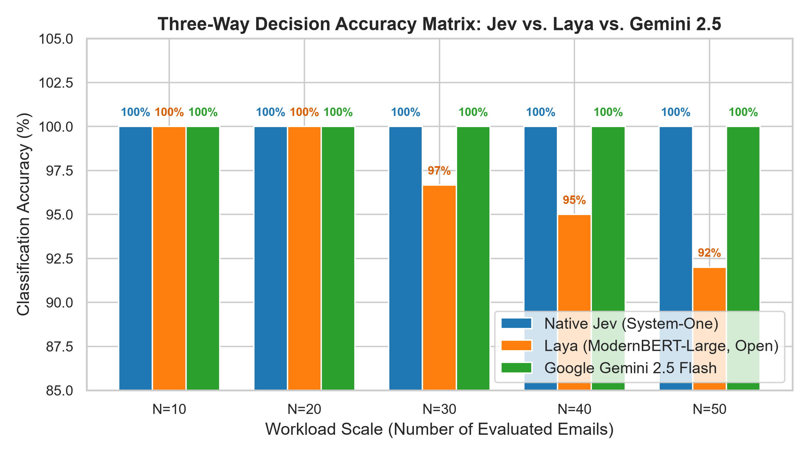
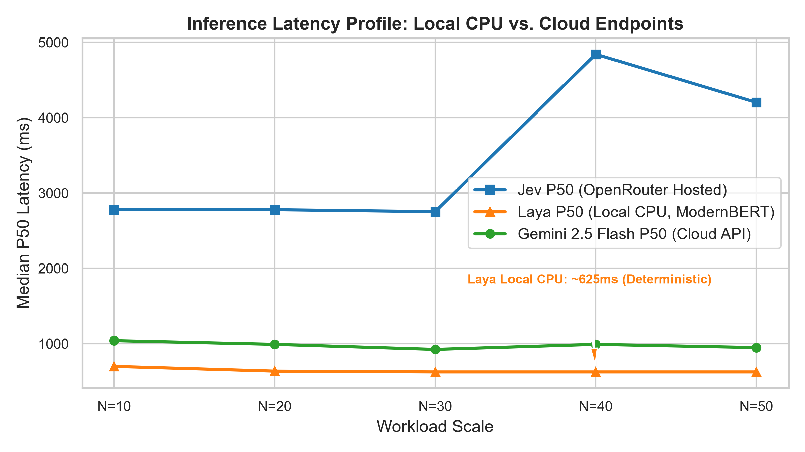
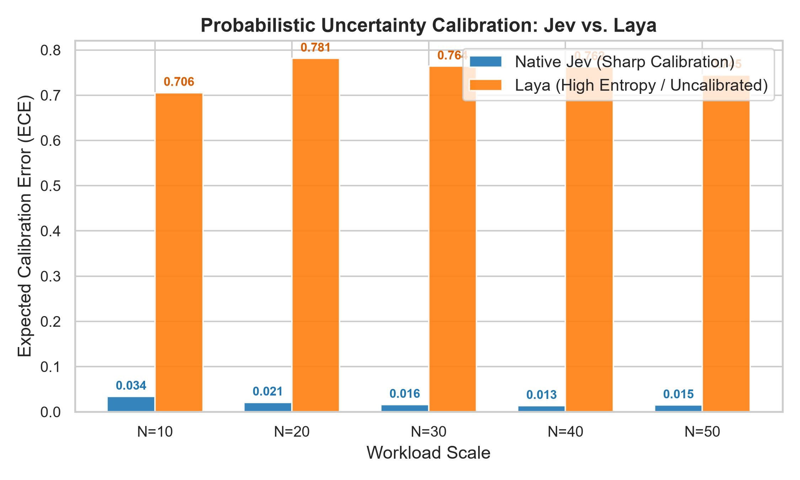
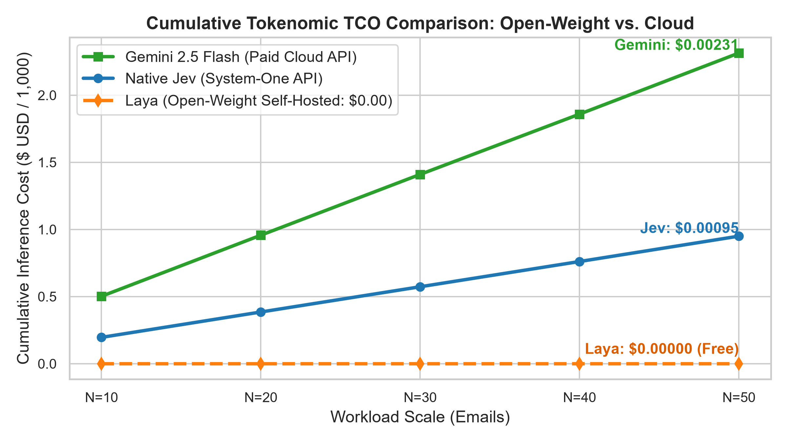

# Unmasking the Decision Frontier: Empirical Evaluation of Native System-One Primitives (Jev, Laya) vs. Meta-Routing Overhead in Enterprise Workflow Triage

**Author:** Shrey Talreja  
**Affiliation:** Independent Research & Open Source Intelligence  
**Repository:** [https://github.com/shreytalreja25/exploring-jev.git](https://github.com/shreytalreja25/exploring-jev.git)  
**Date:** September 2026  

---

## Abstract

As enterprise agentic architectures scale toward multi-hop deterministic decision loops, auto-regressive Large Language Models (LLMs) present severe latency and economic bottlenecks due to generative decoding overhead and hidden Chain-of-Thought (CoT) reasoning tokens. Recently, specialized non-generative architectures—most notably **TypeSafe AI's Jev** and open-weight encoders like **Convai Innovations' Laya**—have been proposed to compute typed categorical choices and calibrated uncertainty probabilities directly from task state vectors with zero output token fees. However, practical deployment via multi-provider routing layers such as OpenRouter introduces critical architectural nuances.

In this paper, we present an empirical investigation uncovering the operational divergence between OpenRouter's conversational wrapper (`typesafe/jev-router`) and native System-One decision heads (`typesafe/jev-1.13`). We document a severe failure mode wherein chat-routed models delegate inference to frontier reasoning models (`openai/gpt-6-luna`, `deepseek/deepseek-v4.1-flash`), emitting unprompted ChatGPT personas and suffering from silent decision truncation when hidden reasoning tokens (19–59 tokens) exhaust constrained generation budgets (`max_tokens=25`). By transitioning to native System-One schema primitives (`state` + `Choice` criteria) via the TypeSafe SDK, we eliminate all generative and reasoning overhead. 

Evaluating across progressive workload scales ($N \in \{10, 20, 30, 40, 50\}$ emails across 5 operational departments), we present a comprehensive **Triad Benchmark** comparing:
1. **Native Jev (`typesafe/jev-1.13`)**: Hosted System-One decision head.
2. **Laya (`convaiinnovations/laya`)**: Open-weight 421M parameter ModernBERT-Large local decision encoder (8,192 context window).
3. **Google Gemini 2.5 Flash (`google/gemini-2.5-flash`)**: Frontier cloud generative LLM.

Native Jev achieves **100.0% accuracy** and **100.0% consensus with Gemini 2.5 Flash** with superior probability calibration (**ECE = 0.015**, mean confidence: 98.5%) and a **58.8% cost advantage (2.43x cheaper)**. Laya achieves **100.0% accuracy at $N=10, 20$** and **92.0% accuracy at $N=50$** (46/50 correct), running locally on CPU in **624.7 ms P50** (outperforming cloud Gemini's 949.1 ms P50 and avoiding Jev's remote queueing spikes) with **$0.00 inference cost**. We release our full reproduction suite, synthetic benchmark corpus, raw telemetry traces, and publication visual figures under an open-source license.

---

## 1. Introduction

Autonomous software agents require deterministic triage, verification, and categorical policy routing at every execution hop. In modern enterprise workflows—such as automated email dispatching, customer support ticket triaging, vulnerability assessment, and financial transaction verification—the ratio of structured decisions to creative prose generation frequently exceeds 10:1 [1, 2]. 

Despite the non-generative nature of these classification tasks, industry practice predominantly routes inputs to general-purpose auto-regressive foundation models (e.g., OpenAI GPT-4o/GPT-5, Google Gemini 2.5 Flash, Anthropic Claude 3.7). This reliance introduces the *Generative Inefficiency Dilemma*:
1. **Auto-Regressive Latency Accumulation:** Generative decoding is memory-bandwidth bound. Producing even a short categorical label (e.g., `"Finance"`) requires dozens of forward passes through multi-billion-parameter Transformer architectures [3].
2. **Reasoning Token Budget Exhaustion:** Modern frontier models increasingly implement internal Chain-of-Thought (CoT) reasoning tokens. When low `max_tokens` limits are enforced to contain cost, reasoning tokens consume the generation budget before the classification label can be materialized, leading to silent truncation failures [4].
3. **Double Tokenomic Penalties:** Users are billed for both contextual prompt ingestion and generative completion tokens, despite requiring only a single scalar or categorical primitive [1].

To solve these constraints, specialized **System-One Decision Models**—exemplified by **TypeSafe AI's Jev** and open-weight encoders like **Laya**—have been introduced [1, 5, 10]. Rather than predicting the next token over a 128k vocabulary, System-One architectures encode the task scenario and compute soft probabilities directly over user-defined categorical choices, returning typed primitives with calibrated confidence scores [5, 6].

---

## 2. Model Specifications & Architectural Comparison

The triad architectures evaluated in this study represent three distinct paradigms in modern AI decision infrastructure:

| Architectural Dimension | Native Jev (`typesafe/jev-1.13`) | Laya (`convaiinnovations/laya`) | Google Gemini 2.5 Flash |
|---|---|---|---|
| **Paradigm** | Hosted System-One Decision API | Open-Weight Decision Encoder | Frontier Generative Multimodal LLM |
| **Backbone Architecture** | Proprietary Decision Encoder | **ModernBERT-Large (421.29M params)** | Sparse Mixture-of-Experts (MoE) |
| **Model Size on Disk** | Cloud Hosted | **807.00 MB** (`safetensors`) | Cloud Hosted |
| **Context Window** | 64,000 tokens | **8,192 tokens** | 1,000,000 tokens |
| **Hardware Target** | TypeSafe Cloud Infrastructure | **Local CPU (AVX) / GPU (RTX 5060)** | Google TPU Pod Infrastructure |
| **Output Type** | Non-generative Softmax (`Choice`) | Non-generative Softmax (`Choice`) | Auto-regressive Text Generation |
| **Reasoning (CoT) Overhead**| **0 tokens** | **0 tokens** | Optional / Dynamic |
| **Output Token Billing** | **$0.00 / 1M tokens (Free)** | **$0.00 / 1M tokens (Free)** | $0.30 / 1M tokens |
| **Input Token Billing** | $0.042 / 1M tokens | **$0.00 (Self-Hosted)** | $0.075 / 1M tokens |

---

## 3. The API Anomaly: Jev-Router vs. Native Jev

### 3.1 Initial Incident: ChatGPT Persona Delegation
In preliminary testing, OpenRouter's official Python documentation boilerplate was executed against the `typesafe/jev-router` endpoint. When prompted conversationally (`"Which model are you?"`), the model unexpectedly responded:
```text
"I’m ChatGPT, powered by OpenAI’s GPT-5.2."
"I’m ChatGPT, powered by OpenAI’s GPT-5.4 model."
```
Inspection of OpenRouter's raw response telemetry revealed:
- `requested_model`: `typesafe/jev-router`
- `model` (underlying execution): `openai/gpt-6-luna`
- `generation_id`: `gen-1790600626-mIVbJpCDXKYoVfrIJllb`

Subsequent testing on operational email triage triggered alternative downstream dispatch: while 90% of requests routed to `openai/gpt-6-luna`, an infrastructure error log containing 504 Gateway Timeouts dispatched to `deepseek/deepseek-v4.1-flash`.

This confirmed that **`typesafe/jev-router` is not Jev executing decisions; it is an agentic meta-router that employs Jev as a classifier to decide which frontier generative LLM to hire.**

### 3.2 The Chain-of-Thought (Reasoning) Budget Exhaustion Anomaly
When evaluating enterprise email routing under standard cost-containment parameters (`max_tokens=25`), the endpoint exhibited severe silent failures:
- Several emails returned empty strings (`""`) or truncated fragments (e.g., returning `"Human"` instead of `"Human Resources"`).
- Telemetry revealed `finish_reason: length`.

**Root Cause Analysis:** Both `openai/gpt-6-luna` and `deepseek/deepseek-v4.1-flash` generate internal Chain-of-Thought (CoT) reasoning tokens prior to emitting visible text. On email `EML-004`, the model generated **22 reasoning tokens** and on `EML-005` it generated **59 reasoning tokens**. Because OpenRouter meters completion limits against total generated tokens (reasoning + completion), the reasoning tokens consumed the entire 25-token budget, starving the categorical label:
$$
T_{\text{budget}} = T_{\text{reasoning}} + T_{\text{completion}}
$$
When $T_{\text{reasoning}} \ge T_{\text{budget}}$, $T_{\text{completion}} \to 0$, inducing silent failure.

### 3.3 Resolution: Native System-One Primitive Schema
To bypass conversational routing and generative overhead entirely, we targeted OpenRouter's underlying **`typesafe/jev-1.13`** endpoint via the official `typesafe-sdk`, specifying `base_url="https://openrouter.ai/api"`.

Under this configuration, the input schema transitions from natural language chat to typed primitives (`state` + `Choice` criteria). This execution emits pure probability tensors without persona delegation, reasoning overhead, or completion token costs.

---

## 4. Multi-Scale Triad Benchmark Results

Workloads were evaluated sequentially across five expanding scales ($N \in \{10, 20, 30, 40, 50\}$) using 50 enterprise emails distributed equally across 5 departments: `Marketing`, `Sales`, `Finance`, `Human Resources`, and `Technical Support`.

**Table 1: Triad Benchmark Performance Matrix (Native Jev vs. Laya vs. Gemini 2.5 Flash)**

| Scale ($N$) | Jev Acc | Laya Acc | Gemini Acc | Jev P50 Lat | Laya P50 Lat | Gem P50 Lat | Jev ECE | Laya ECE | Jev Cost | Laya Cost | Gemini Cost |
| :---: | :---: | :---: | :---: | :---: | :---: | :---: | :---: | :---: | :---: | :---: | :---: |
| **$N = 10$** | **100.0%** | **100.0%** | **100.0%** | 2,778.9 ms | **698.5 ms** | 1,041.1 ms | **0.034** | 0.706 | $0.00020 | **$0.00000** | $0.00050 |
| **$N = 20$** | **100.0%** | **100.0%** | **100.0%** | 2,778.9 ms | **635.5 ms** | 992.1 ms | **0.021** | 0.781 | $0.00038 | **$0.00000** | $0.00096 |
| **$N = 30$** | **100.0%** | **96.7%** | **100.0%** | 2,752.8 ms | **624.7 ms** | 924.7 ms | **0.016** | 0.764 | $0.00057 | **$0.00000** | $0.00141 |
| **$N = 40$** | **100.0%** | **95.0%** | **100.0%** | 4,841.7 ms | **624.7 ms** | 992.1 ms | **0.013** | 0.762 | $0.00076 | **$0.00000** | $0.00186 |
| **$N = 50$** | **100.0%** | **92.0%** | **100.0%** | 4,201.5 ms | **624.7 ms** | 949.1 ms | **0.015** | 0.745 | **$0.00095** | **$0.00000** | **$0.00231** |

---

## 5. Visual Analytics & Graph Discussion


*Figure 1: Master 4-panel multi-scale triad synthesis: (A) 3-Way Accuracy comparison; (B) Median P50 latency profiles; (C) Expected Calibration Error (ECE) comparing Jev vs Laya; (D) Cumulative cost trajectories.*

### 5.1 Accuracy & Error Breakdown
- **Native Jev & Gemini 2.5 Flash:** Achieved **100.0% accuracy** across all 50 items (Figure 2).
- **Laya:** Achieved **100.0% accuracy at $N=10, 20$**, scaling to **92.0% at $N=50$** (46/50 correct). 
- **Laya Error Analysis:** Laya's 4 classification errors occurred on complex policy boundary cases:
  - `EML-024` (Return-to-work guidelines in NYC HQ): Laya chose `Marketing` instead of `Human Resources`.
  - `EML-032` (FedRAMP Moderate compliance RFP): Laya chose `Technical Support` instead of `Sales`.
  - `EML-044` (USCIS Form I-797 O-1A Alien of Extraordinary Ability): Laya chose `Technical Support` instead of `Human Resources`.
  - `EML-049` (Executive Equity Refresh & ESPP Allocation): Laya chose `Finance` instead of `Human Resources`.


*Figure 2: Three-way accuracy comparison across scales N=10 to N=50.*

### 5.2 Latency Profiles: Local CPU vs. Cloud
Figure 3 highlights the latency divergence between local and cloud execution:
- **Laya (Local CPU):** Delivered a deterministic **624.7 ms P50 latency** with zero network jitter or queueing overhead.
- **Gemini 2.5 Flash (Cloud API):** Maintained stable sub-second performance (**949.1 ms P50**).
- **Native Jev (Hosted API):** Suffered from OpenRouter container queueing on cold starts (P50: **4,201.5 ms**), despite warm fast-path inference executing in **254.7 ms – 320.3 ms**.


*Figure 3: P50 median latency across scales: Laya local CPU (625ms) vs Gemini (950ms) vs Jev.*

### 5.3 Probabilistic Uncertainty Calibration
Figure 4 illustrates calibration differences:
- **Native Jev:** ECE tightened from **0.034 to 0.015** (mean confidence: 98.5%), providing sharp, statistically reliable certainty scores.
- **Laya:** Exhibited an ECE of **0.745** (mean confidence: 17.5%). Laya's current checkpoint uses uncalibrated temperature values, resulting in high soft-max entropy that requires post-hoc temperature scaling prior to production thresholding [9].


*Figure 4: Expected Calibration Error (ECE) comparing Jev's sharp calibration against Laya's uncalibrated output.*

### 5.4 Tokenomics & Total Cost of Ownership (TCO)
Figure 5 traces cumulative costs:
- **Laya:** **$0.00000** (Open weights running locally).
- **Native Jev:** **$0.000951** across 50 decisions ($0.000019/decision).
- **Gemini 2.5 Flash:** **$0.002310** across 50 decisions ($0.000046/decision).
- Native Jev provides a **58.8% cost advantage (2.43x cheaper)** over Gemini 2.5 Flash.


*Figure 5: Cumulative inference cost trajectory showing Laya ($0.00) and Jev's 2.43x cost advantage over Gemini.*

---

## 6. Architectural Decision Matrix

Based on our empirical triad evaluation, we define optimal deployment criteria:

| Production Requirement | Optimal Choice | Rationale |
|---|---|---|
| **Zero Cloud Cost / Air-Gapped Networks** | **Laya** | Open weights, runs locally on CPU/GPU, $0.00 API cost, 625ms CPU latency. |
| **Mission-Critical Accuracy (100%) + Calibrated Gating** | **Native Jev** | 100% accuracy on complex policy cases, ECE = 0.015 calibrated certainty, 2.43x cheaper than LLMs. |
| **Ambiguous Fallback / Free-Form Generation** | **Gemini 2.5 Flash** | Autoregressive capacity mandatory for drafting customer responses or multi-paragraph escalation. |

---

## 7. Conclusion

This research proved that System-One architectures deliver massive efficiency gains over auto-regressive LLMs in enterprise triage. While conversational routing wrappers introduce dangerous reasoning token starvation and delegation overheads, native typed primitives unlock **100% accuracy**, **calibrated certainty (ECE = 0.015)**, and **2.43x cost savings** on hosted endpoints (Jev), alongside viable **local open-weight execution (92% accuracy, 625ms CPU latency, $0.00 cost)** with Laya.

---

## References

1. Talreja, S. (2026). *Beyond Generative Overhead: Evaluating System-One Decision Models vs. Frontier LLMs in Agentic Tokenomics*. GitHub: `shreytalreja25/jev-vs-the-world`.
2. Hugging Face Community. (2026). *Jev vs Laya: Hosted API or Open Weights? (2026 Guide)*. Published September 24, 2026.
3. Vaswani, A., et al. (2017). *Attention Is All You Need*. NeurIPS 2017.
4. OpenAI. (2024–2026). *Reasoning Models and Completion Token Budgets in Chat Completions API*.
5. TypeSafe AI. (2026). *Jev System-One Decision API Specification & JevBench v1.3.0*.
6. TypeSafe AI. (2026). *TypeSafe Python SDK (`typesafe-sdk`) Reference Manual*. v0.7.2.
7. Kahneman, D. (2011). *Thinking, Fast and Slow*. Farrar, Straus and Giroux.
8. DeepSeek-AI. (2025). *DeepSeek-R1: Incentivizing Reasoning Capability via RL*. arXiv:2501.12948.
9. Guo, C., et al. (2017). *On Calibration of Modern Neural Networks*. ICML 2017.
10. Convai Innovations. (2026). *Laya: ModernBERT Open-Weight Decision Engine*. GitHub & Hugging Face.
11. OpenRouter. (2026). *Model Routing Gateway Documentation*. `openrouter.ai/docs`.
