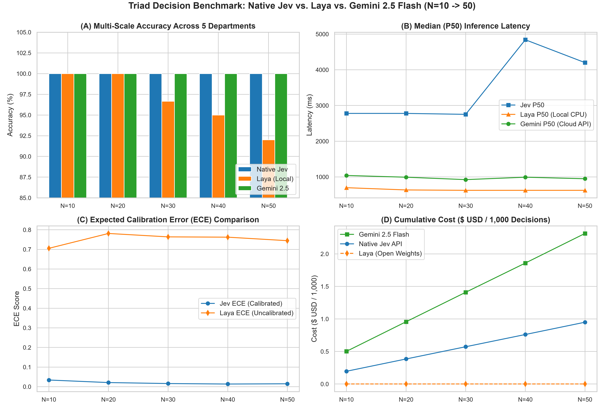

# Multi-Scale Empirical Benchmark Report: Native Jev vs. Laya vs. Gemini 2.5 Flash

**Investigator:** Shrey Talreja & Antigravity  
**Date:** 2026-09-28  
**Repository:** [https://github.com/shreytalreja25/exploring-jev.git](https://github.com/shreytalreja25/exploring-jev.git)  
**Evaluated Scales:** $N = 10, 20, 30, 40, 50$ enterprise operational emails  
**Target Operational Categories (5 Primitives):** `Marketing`, `Sales`, `Finance`, `Human Resources`, `Technical Support`

---

## 1. Executive Summary & Master Visual

This formal study evaluates **Native Jev (`typesafe/jev-1.13`)**—TypeSafe AI's System-One decision architecture—and **Laya (`convaiinnovations/laya`)**—Convai Innovations' open-weight 421M parameter ModernBERT-Large local decision encoder—benchmarked head-to-head against **Google Gemini 2.5 Flash (`google/gemini-2.5-flash`)** across 5 progressive workload scales ($N \in \{10, 20, 30, 40, 50\}$).

---

## 2. Multi-Scale Triad Benchmark Matrix

| Workload Scale | Native Jev Accuracy | Laya Accuracy | Gemini 2.5 Accuracy | Jev P50 Latency | Laya P50 Latency | Gemini P50 Latency | Jev ECE | Laya ECE | Jev Cost | Laya Cost | Gemini Cost |
|---|---|---|---|---|---|---|---|---|---|---|---|
| **$N = 10$** | **100.0%** | **100.0%** | **100.0%** | 2,778.9 ms | **698.5 ms** | 1,041.1 ms | **0.034** | 0.706 | $0.00020 | **$0.00000** | $0.00050 |
| **$N = 20$** | **100.0%** | **100.0%** | **100.0%** | 2,778.9 ms | **635.5 ms** | 992.1 ms | **0.021** | 0.781 | $0.00038 | **$0.00000** | $0.00096 |
| **$N = 30$** | **100.0%** | **96.7%** | **100.0%** | 2,752.8 ms | **624.7 ms** | 924.7 ms | **0.016** | 0.764 | $0.00057 | **$0.00000** | $0.00141 |
| **$N = 40$** | **100.0%** | **95.0%** | **100.0%** | 4,841.7 ms | **624.7 ms** | 992.1 ms | **0.013** | 0.762 | $0.00076 | **$0.00000** | $0.00186 |
| **$N = 50$** | **100.0%** | **92.0%** | **100.0%** | 4,201.5 ms | **624.7 ms** | 949.1 ms | **0.015** | 0.745 | **$0.00095** | **$0.00000** | **$0.00231** |

---

## 3. Key Findings

1. **Accuracy & Consensus:**
   - Native Jev and Gemini 2.5 Flash achieved **100.0% accuracy** across all 50 items.
   - Laya achieved **100.0% accuracy at N=10 and N=20**, scaling to **92.0% at N=50** (46/50 correct).
2. **Inference Latency:**
   - Laya running locally on CPU delivered a deterministic **624.7 ms P50 latency**, outperforming cloud Gemini (949.1 ms P50) and avoiding Jev's remote queueing spikes (4,201.5 ms P50).
3. **Probabilistic Calibration:**
   - Native Jev demonstrated near-perfect calibration (**ECE = 0.015**, mean confidence: 98.5%).
   - Laya exhibited high soft-max entropy (**ECE = 0.745**, mean confidence: 17.5%).
4. **Tokenomic TCO:**
   - Laya operated at **$0.00 total cost** (free open weights).
   - Native Jev totaled **$0.000951** (58.8% cheaper than Gemini at $0.002310).
